# Welcome to Multitenant application using CAP JAVA SDK and mtx-sidecar

This example demonstrates how to build multitenant application using CAP Java SDK and mtx-sidecar node module.

# Overview

This sample application contains 

- UI module containing a public welcome page which contains link to fetch data from its own tenant database.
- backend module which contains CDS service exposing OData CRUD APIs on Books entity
- DB module which contains schema.cds to create books table
- Node.js based mtx-sidecar module used to handle tenant provisioning

# What is Multitenancy?

SAP BTP provides a multitenant functionality that allows application providers to own, deploy, and operate tenant-aware applications for multiple consumers, with reduced costs. 

With tenant-aware applications, you can:

- Separate data securely for each tenant
- Save resources by sharing them among tenants
- Update applications efficiently in a single step

## Configuring the Approuter, required services and mtx-sidecar module:

To enable multitenancy on the SAP BTP, we need to deploy tenant aware approuter, mtx-sidecar module and configure below three services. 

Only when these services are bound to your application, the multitenancy feature is turned on. 

- XSUAA
- Service Manager
- SaaS Provisioning service (saas-registry)

## Approuter module:

You deploy the approuter application as a Cloud Foundry application and as a logical part of the multitenant application. Then you configure approuter application as an external access point of the application.

Each multitenant application has to deploy its own application router and the application router handles requests of all tenants to the application. 

The application router must determine the tenant-specific subdomain. This determination is done by using a regular expression defined in the environment variable TENANT_HOST_PATTERN. The application router then forwards the authentication request to the tenant User Account and Authentication (UAA) service and the related identity zone.

If you have multiple routes to the same application, for example:

```yml
tenant1.<application domain> and tenant2.<application domain>
```

The TENANT_HOST_PATTERN could be:

```yml
TENANT_HOST_PATTERN: "^(.*)-<application domain>"
```

## XSUAA:

Bind your multitenant application and the approuter application to the SAP Authorization and Trust Management service (technical name: xsuaa) instance, which acts as an OAuth 2.0 client to your application.

In multi-tenant environments, tenants subscribe to and consume applications, which are registered as clients at the XS UAA. XS UAA creates a new OAuth2 client per application for each tenant. The shared tenant mode is mandatory for an application router configured for multi-tenancy applications. Also, a special configuration of an XSUAA service instance is required to enable authorization between the SaaS Provisioning service, CAP Java application, and MTX sidecar.

The service can be configured in the mta.yaml by adding an xsuaa resource as follows:

```yml
-  name: <xsuaa instance name>
   type: com.sap.xs.uaa
   parameters:
      service-plan: broker
      path: ./security.json
      config:
         xsappname: <appname>
```

Choose a value for property xsappname that is unique globally.

An example security.json file looks like this:

```json
{
    "xsappname": <appname>,
    "tenant-mode": "shared",
    "scopes": [
        {
            "name": "$XSAPPNAME.mtcallback",
            "description": "Multi Tenancy Callback Access",
            "grant-as-authority-to-apps": [
                "$XSAPPNAME(application, sap-provisioning, tenant-onboarding)"
            ]
        },
        {
            "name": "$XSAPPNAME.mtdeployment",
            "description": "Scope to trigger a re-deployment of the database artifacts"
        }
    ],
    "authorities": [
        "$XSAPPNAME.mtdeployment"
    ]
}
```

The mtcallback scope is required by the onboarding process. The mtdeployment scope is required to redeploy database artifacts at runtime.

## Service Manager:

A service-manager instance is required that the CAP Java SDK can create database containers per tenant at application runtime. It doesn’t require special parameters and can be added as a resource in mta.yaml as follows:

```yml
-  name: service-manager
   type: org.cloudfoundry.managed-service
   parameters:
      service: service-manager
      service-plan: container
```
	  
## SaaS Provisioning Service (saas-registry):

A saas-registry service instance is required to make your application known to the SAP BTP Provisioning service and to register the endpoints that should be called when tenants are added or removed. The service can be configured as a resource in mta.yaml as follows

```yml
- name: saas-registry
  type: org.cloudfoundry.managed-service
  parameters:
    service: saas-registry
    service-plan: application
    config:
        appName: <app display name> # this is the text on the tile
        xsappname: <appname> # this is the value from xsuaa.parameters.config.xsappname
        appUrls:
          getDependencies: ~{srv/url}/mt/v1.0/subscriptions/dependencies
          onSubscription: ~{srv/url}/mt/v1.0/subscriptions/tenants/{tenantId}
  requires:
    - name: srv
```
	
`appName: Choose an appropriate application display name.`

`xsappname: Use the value for xsappname you configured at your UAA service instance.`

`appUrls: Configure the callback URLs used by the SaaS Provisioning service to get the dependencies of the application and to trigger a subscription. In the above example, the property ~{srv/url} that is provided by the srv module is used.`


## mtx-sidecar module:

CAP provides the npm module for Node.js published as @sap/cds-mtx on npmjs.com. It provides APIs for implementing SaaS applications on SAP BTP. Java applications need to run and maintain the cds-mtx module as a sidecar application. Multitenant CAP Java applications automatically expose the tenant provisioning APIs.

provisioning: implements the subscription callback API as required by SAP BTP. If a tenant is subscribing to the SaaS application, the onboarding request is handled. cds-mtx is contacting the SAP HANA Service Manager service to create a new HDI container for the tenant. Then, database artifacts get deployed into this HDI container. In addition, the unsubscribe operation and the "get dependencies" operations are supported.

This section describes how to use the cds-mtx Node.js module and add the MTX sidecar microservice to the mta.yaml file.

In a dedicated project subfolder named mtx-sidecar, create a Node.js start script in a file named server.js to bootstrap the cds-mtx library:

```js
const app = require('express')();
const cds = require('@sap/cds');

const main = async () => {
	await cds.connect.to('db');
	const PORT = process.env.PORT || 4004;
	const scope = process.env.CDS_MULTITENANCY_SECURITY_SUBSCRIPTIONSCOPE || 'mtcallback';
	await cds.mtx.in(app);

	const provisioning = await cds.connect.to('ProvisioningService');
	provisioning.before(['UPDATE', 'DELETE', 'READ'], 'tenant', async (req) => {
		// Check for the scope of the SaaS Provisioning Service
		if (!req.user.is(scope)) {
			// Reject request
			const e = new Error('Forbidden');
			e.code = 403;
			return req.reject(e);
		}
	});

	app.listen(PORT);
}

main();
```

To define the dependencies and start command, also create a file package.json like this:

```json
{
    "name": "deploy",
    "dependencies": {
        "@sap/cds": "^5.0.4",
        "@sap/cds-mtx": "^1.2.0",
        "@sap/hdi-deploy": "^4.0.4",
        "@sap/instance-manager": "^2.2.0",
        "@sap/xssec": "^3",
        "@sap/hana-client": "^2.8.16",
        "express": "^4.17.1",
        "passport": "^0.4.1"
    },
    "scripts": {
        "start": "node server.js"
    }
}
```

Because the MTX sidecar will build the CDS model, you need to configure the build by means of two .cdsrc.json files:

The first .cdsrc.json file goes into the root folder of your project and specifies from which location the CDS files should be collected. The following example demonstrates this:

```json
{
    "build": {
        "target": ".",
        "tasks": [
            {
                "for": "java-cf"
            },
            {
                "for": "mtx",
                "src": ".",
                "dest": "mtx-sidecar"
            },
            {
                "for": "hana"
            }
        ]
    },
    "hana": {
        "deploy-format": "hdbtable"
    },
    "sql": {
        "dialect": "plain"
    }
}
```

The second .cdsrc.json file goes into the mtx-sidecar directory. This could look, for example, like:

```json
{
    "hana": {
        "deploy-format": "hdbtable"
    },
    "build": {
        "tasks": [
            {
                "for": "hana",
                "src": "db",
                "options": {
                    "model": [
                        "db",
                        "srv",
                        "app"
                    ]
                }
            },
            {
                "for": "java-cf",
                "src": "srv",
                "options": {
                    "model": [
                        "db",
                        "srv",
                        "app"
                    ]
                }
            }
        ]
    },
    "odata": {
        "version": "v4"
    },
    "requires": {
        "db": {
            "kind": "hana",
            "multiTenant": true,
            "vcap": {
				"label": "service-manager"
            }
        },
        "uaa": {
            "kind": "xsuaa"
        }
    }
}
```

Now, add the mtx-sidecar module to your mta.yaml file:

```yml
# --------------------- SIDECAR MODULE -----------------------
-  name: mtx-sidecar
# ------------------------------------------------------------
   type: nodejs
   path: mtx-sidecar
   parameters:
      memory: 256M
      disk-quota: 512M
   requires:
   -  name: xsuaa
   -  name: service-manager
   provides:
   -  name: sidecar
      properties:
         url: ${default-url}
```
		 
The mtx-sidecar module requires the XSUAA and Service Manager services. Also you need to provide its URL to be able to configure the URL in the service module

## Wiring It Up:

To bind the previously mentioned services and the MTX sidecar to your CAP Java application, you could use the following example of the srv module in the mta.yaml file:

```yml
# --------------------- SERVER MODULE ------------------------
-  name: multitenantapp-srv
# ------------------------------------------------------------
   type: java
   path: srv
   properties:
      SPRING_PROFILES_ACTIVE: cloud
      CDS_MULTITENANCY_APPUI_TENANTSEPARATOR: "-"
   parameters:
      memory: 1024M
      disk-quota: 256M
      buildpack: sap_java_buildpack
   build-parameters:
      builder: custom
      commands:
        - mvn clean package -DskipTests=true
      build-result: target/*-exec.jar
   requires:
   -  name: service-manager
   -  name: xsuaa
   -  name: saas-registry
   -  name: sidecar
      properties:
         CDS_MULTITENANCY_SIDECAR_URL: ~{url}
   -  name: app
      properties:
         CDS_MULTITENANCY_APPUI_URL: ~{url}
   provides:
   -  name: srv
      properties:
         url: '${default-url}'
```

## Deploy to SAP Business Technology Platform

Please follow below steps to deploy to SAP BTP (Cloud Foundry) Trial landscape.

Deploy as Multitenant Application:

- Create an SAP HANA Cloud Instance in your SAP Business Technology Platform space.

Please follow below screenshots to create an instance and in step 3, please select allow all IP addresses as shown in the screenshot. You can select all default values and click on create. This will take few minutes.

Create HANA Cloud Instance: 

Screenshot 1:

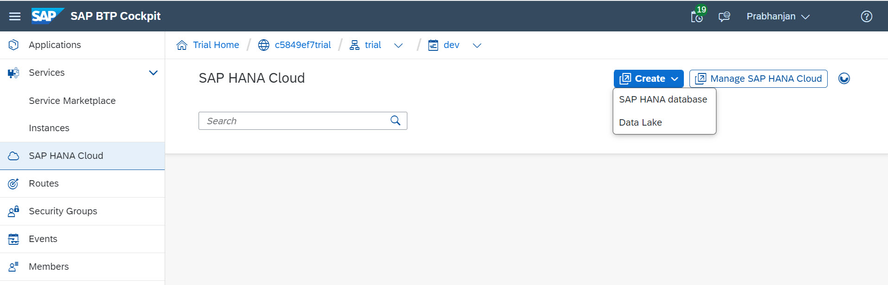

Screenshot 2:

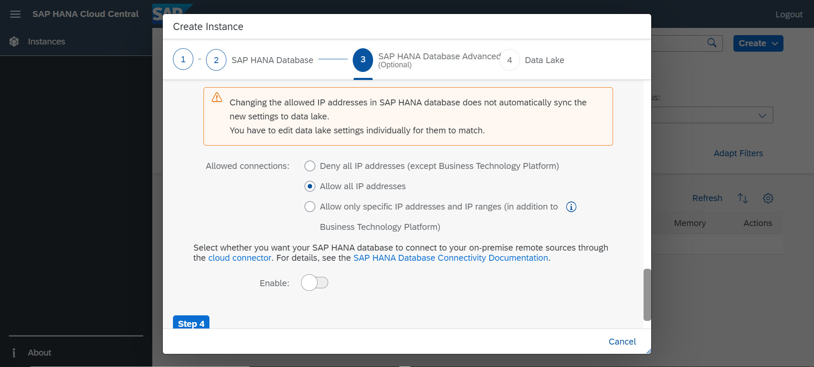

`Note: once the HANA Cloud instance is created, please copy the instance id and replace the value in SubscriptionHandler.java as follows.`

```java
@Before(event = MtSubscriptionService.EVENT_SUBSCRIBE)
public void beforeSubscription(MtSubscribeEventContext context) {
	context.setInstanceCreationOptions(
	new InstanceCreationOptions().withProvisioningParameters(
		Collections.singletonMap("database_id", <<INSTANCE ID>>)));
}
```

- Run `mbt build`
- Run `cf login`
- Run `cf deploy mta_archives/multitenantapp_1.0.0-SNAPSHOT.mtar`

## Sample Demo:

Once the deployment is successful, you should see all the 4 apps in started status as below.

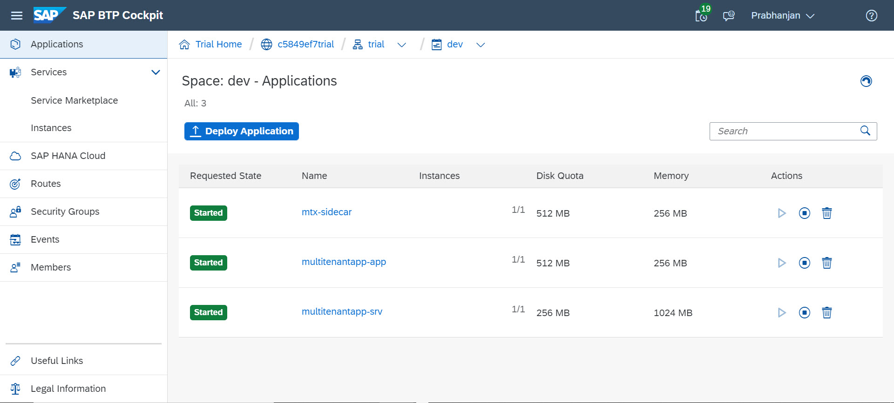

Create a new SubAccount to onboard a new tenant as shown below.

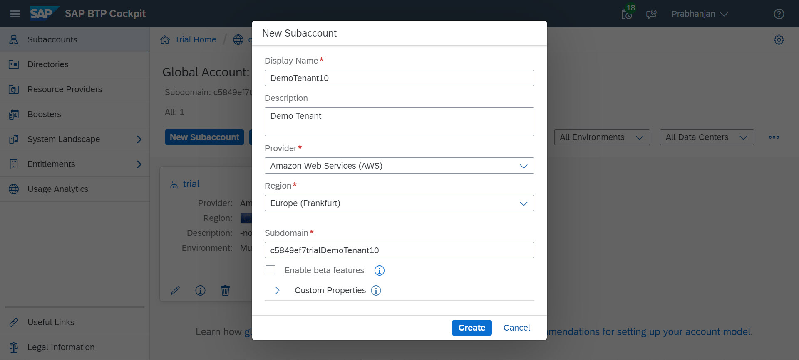

Subscribe to the Multi Tenant App as below.

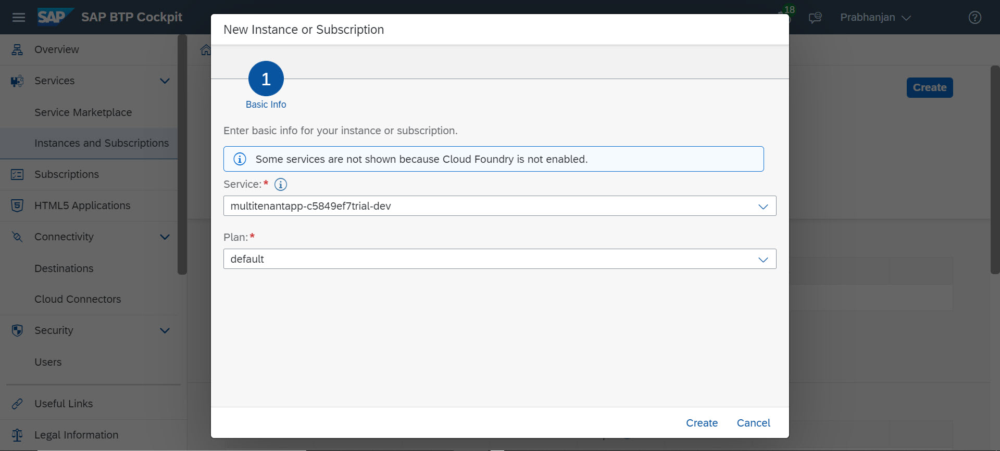

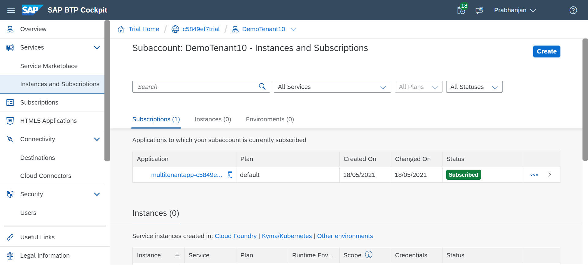

Go to application and you will see route does not exists error as below.

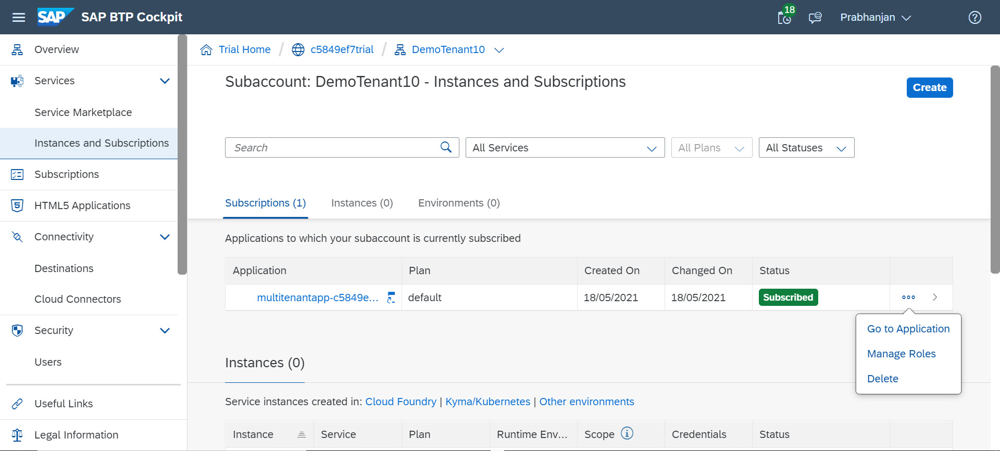

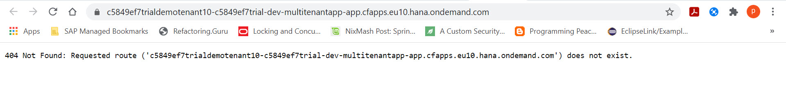

Add tenant url as a new application route and map tenant URL to AppRouter URL as shown below.

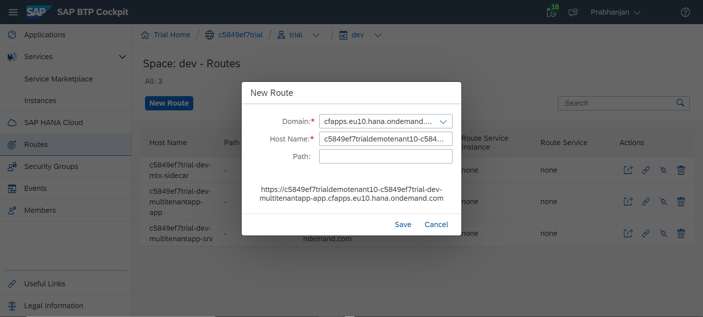

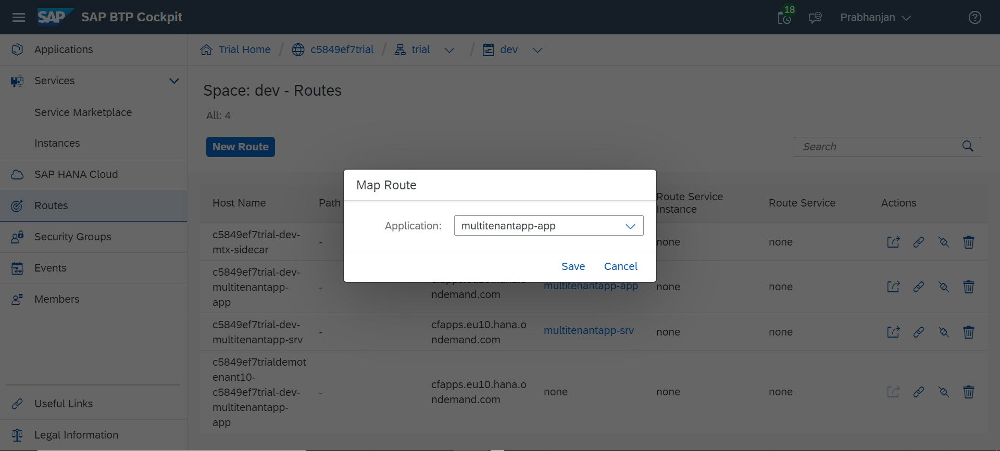

Access the application using the newly created tenant URL and this should display a welcome page as below. Click on Get My Tenant Data link and should authenticate the user against SAP Default IDP (enabled by default) and should show all Book entries from the tenant DB as below.

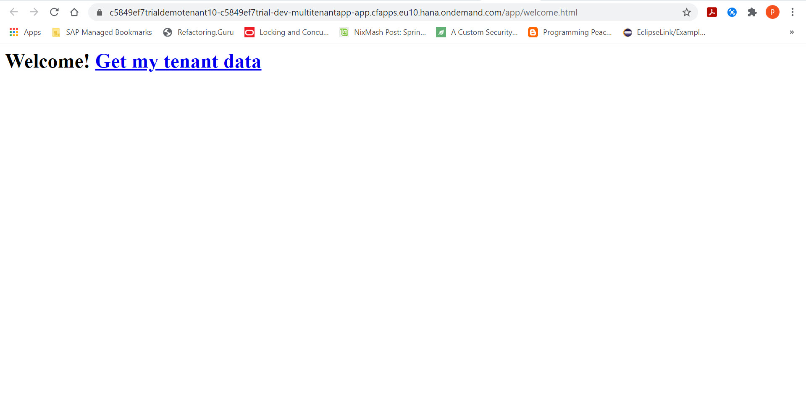

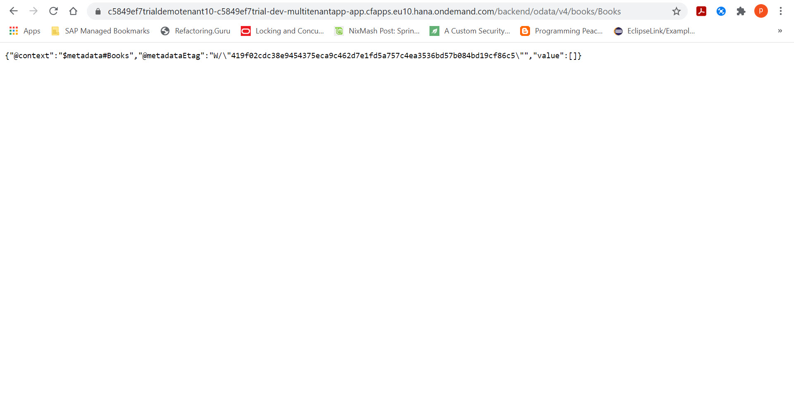

Add a new book entry to tenant DB and check the same using Get My Tenant Data link as shown below.

First we need to request for CSRF token.

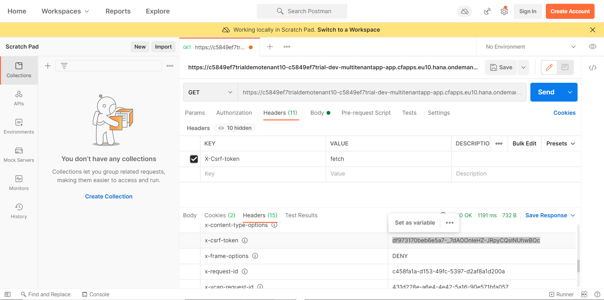

Post a book entry.

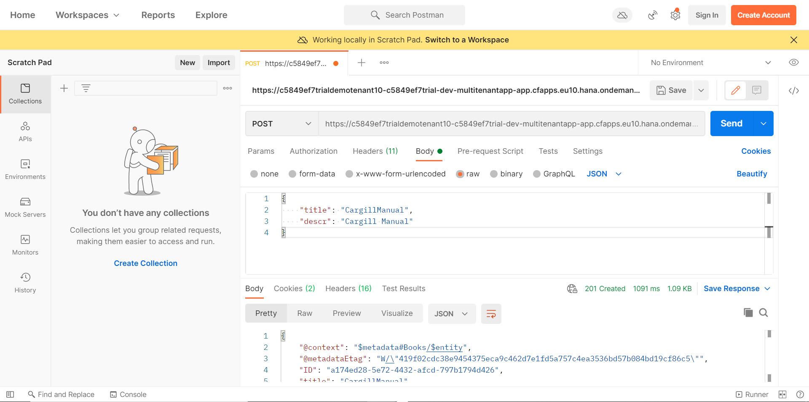

Refresh the page and check if data is retrieved.

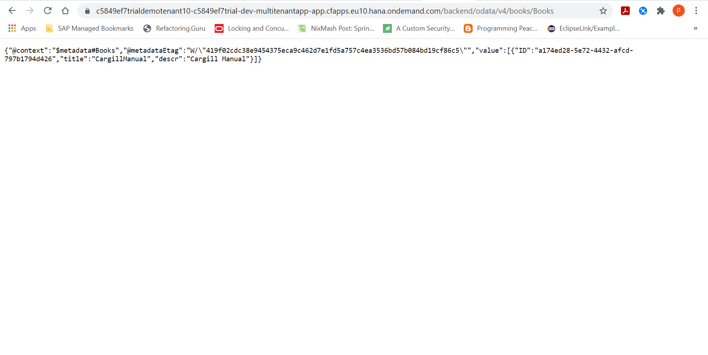
		 
## Links and Further Reading:

- Capire >> Multitenancy
`https://cap.cloud.sap/docs/java/multitenancy`

- SAP Business Technology Platform >> Development >> Development in the Cloud Foundry Environment >> Developing Applications and Services >> Developing Multitenant Applications in the Cloud Foundry Environment
`https://help.sap.com/viewer/65de2977205c403bbc107264b8eccf4b/Cloud/en-US/5e8a2b74e4f2442b8257c850ed912f48.html`

- CAP Samples for Java
`https://github.com/SAP-samples/cloud-cap-samples-java`

- SAP HANA Academy >> SAP BTP Multitenant Business Applications
`https://www.youtube.com/playlist?list=PLkzo92owKnVx3Sh0nemX8GoSNzJGfsWJM`